# Hi there, I'm Ilyes! 👋

<div align="center">
  <a href="https://git.io/typing-svg"></a>
</div>

## 🚀 About Me


```javascript
const ilyes = {
    location: "Paris, France 🇫🇷",
    passion: ["System Design", "Software Architecture", "Clean Code"],
    currentlyExploring: {
        ai: "Reinforcement Learning & Deep Learning models",
        infrastructure: "DevOps practices & scalable system design",
        emerging_tech: "Blockchain integration & GenAI applications"
    },
    approach: "Build solid foundations, then optimize relentlessly",
    learning: "Infrastructure side of large-scale software systems",
    hobby: "Testing new technologies in real projects",
    philosophy: "Good software architecture is invisible until you need it",
    contact: "ilyes.arabet.pro@gmail.com"
};
```

---

## 🌟 Featured Projects

### 🏗️ [calM - CPU Architecture Learning Machine](https://github.com/Calm-ESI/Calm)
**Tech Stack:** React, GSAP, Node.js, Express, PostgreSQL, Langchain  
A web-based CPU simulator that teaches computer architecture through hands-on experience. Students can write assembly code, execute it step-by-step, and see how instructions flow through the CPU pipeline. Built with an interactive interface and includes structured courses.

### 🗺️ [Indoor Navigation for Visually Impaired](https://github.com/SoftGuar/cartographie_service)
**Tech Stack:** FastAPI, PostgreSQL, OpenCV, ML Pipeline  
Developed the backend for an assistive navigation system that processes floor plans and architectural drawings. The system identifies walls, doors, and furniture using computer vision, then generates accessible routes with voice guidance. Part of a larger IoT ecosystem that tracks user movement in real-time. [Full project](https://github.com/SoftGuar)

### 🏦 [Multi-Agent IFRS AAOIFI System](https://github.com/isdb-ELFARI9/multi_agents_IFRS_AAOIFI)
**Tech Stack:** LangGraph, FastAPI, Pinecone, Multi-Agent Architecture  
An AI system that analyzes financial news and situations to recommend updates to Islamic finance standards. Uses specialized agents for different tasks - one gathers news, another identifies gaps in current standards, and expert agents propose specific improvements. Includes human oversight for validation. [Documentation](https://docs.google.com/document/d/1YJ6aLFttcMmjVjebyktLvjKfPOne63MYfw_ZW8Re5_8/edit?usp=sharing)

### 🏆 [Sensor Data Ingestion System](https://github.com/ar-ilyes/Sensor-Data-Ingestion-System) 
**🥇 1st Place DevFest Hackathon Winner**  
**Tech Stack:** RabbitMQ, Next.js, InfluxDB, Microservices  
A production monitoring system for manufacturing environments. Handles thousands of sensor readings per second, processes them through multiple microservices, and displays real-time dashboards. Each service has its own database and communicates through message queues. Built with scalability and fault tolerance in mind.

### 📱 [AprilTags Indoor Positioning](https://github.com/ar-ilyes/april-tags-simple-pos)
**Tech Stack:** Kotlin, OpenCV, Computer Vision  
An Android app that determines your exact position inside a building using AprilTag markers on walls. Processes camera input to detect tags and calculates position through triangulation. Useful for navigation in places where GPS doesn't work well.

---

<div align="center">
  <i>More projects available in my repositories</i>
</div>

---

## 📊 GitHub Analytics

<div align="center">
  
[](https://github.com/ar-ilyes)

[](https://github.com/ar-ilyes)

[](https://git.io/streak-stats)

</div>

---

## 🛠️ Technologies I've Worked With

*Here are the technologies I've worked with and tested so far*

### **Frontend Development**
<div align="left">
  
</div>

### **Backend Development**
<div align="left">
  
</div>

### **Databases**
<div align="left">
  
  
</div>

### **Mobile Development**
<div align="left">
  
  
</div>

### **Data Science & ML**
<div align="left">
  
  
  
  
  
</div>

### **DevOps & Tools**
<div align="left">
  
  
</div>

---

## 📈 Contribution Activity

<div align="center">
  



</div>

---

## 🌐 Connect With Me

<div align="center">
  
[](https://www.linkedin.com/in/ilyes-arabet-b25851220/)
[](https://discord.gg/ilyesarabet)
[](mailto:ilyes.arabet.pro@gmail.com)

</div>

---

<div align="center">
  
### ✨ *"Code is poetry written in logic"* ✨


</div>
